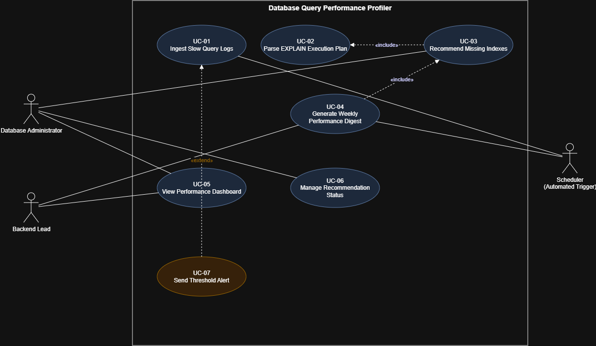

# Lab 1 — Requirements Engineering & UML Use-Case Modelling

**Name:** Krishitha Kankanala  
**SRN:** PES2UG24CS234  
**Class:** 5D  
**Course:** PES University — Dept. of CSE

## Problem Statement

**#44 — Developer Tools & IT Operations: Database Query Performance Profiler**

The project is a database observability tool that collects slow query logs, analyzes SQL execution plans, identifies possible missing indexes, and generates weekly performance optimization digests.

**Target Stakeholders / Actors:** Database Administrator, Backend Lead

## Repository Contents

| File | Description |
|---|---|
| `Lab1_Combined.docx` | Full submission containing the requirements table, UML use-case diagram, and use-case flow in one document |
| `DB_Query_Profiler_UseCase.png` | Image of the UML use-case diagram |
| `README.md` | This README file |

## Deliverable Summary

### 1. Requirements Table

- **5 Functional Requirements** (FR-001–FR-005) covering EXPLAIN plan parsing, slow query log ingestion, weekly digest generation, recommendation status tracking, and threshold-based alerting.
- **2 Non-Functional Requirements** (NFR-001–NFR-002) covering ingestion throughput/scale and data security through encryption at rest and role-based access control.
- Each requirement includes its **ID, Type, Description, Priority, Acceptance Criteria, and Rationale**.

### 2. UML Use-Case Diagram

- **Actors:** Database Administrator, Backend Lead, Scheduler (automated trigger)
- **Use Cases (UC-01–UC-07):** Ingest Slow Query Logs, Parse EXPLAIN Execution Plan, Recommend Missing Indexes, Generate Weekly Performance Digest, View Performance Dashboard, Manage Recommendation Status, Send Threshold Alert
- **«include»:** Recommend Missing Indexes includes Parse EXPLAIN Execution Plan; Generate Weekly Performance Digest includes Recommend Missing Indexes
- **«extend»:** Send Threshold Alert extends Ingest Slow Query Logs

### 3. Use-Case Flow

- **Use Case:** Recommend Missing Indexes
- **Primary Actor:** Database Administrator
- **Secondary Actor:** Scheduler (automated trigger)
- Includes a **9-step Main Flow** describing how the system analyzes queries and generates index recommendations.
- Includes an **Alternate Flow** for the case where no sequential scans are found.

## Tools Used

- **draw.io** — used for UML use-case modelling.
